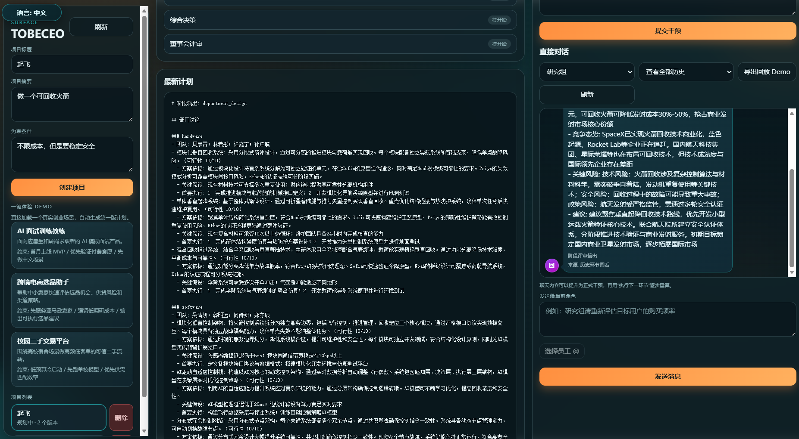
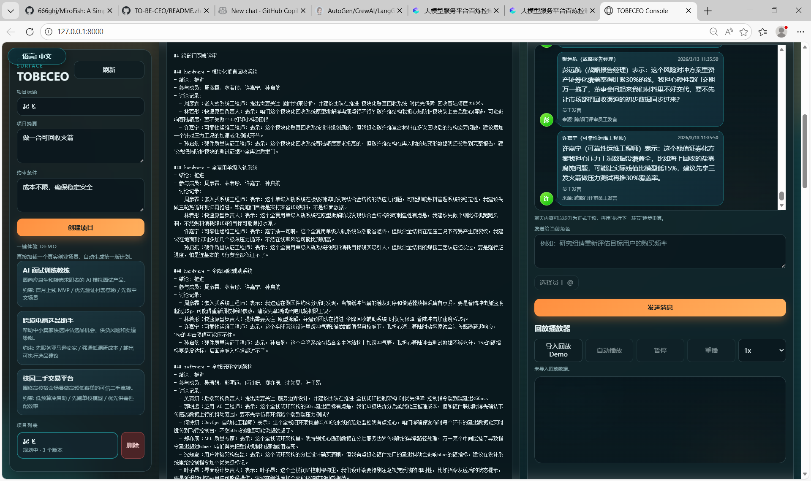
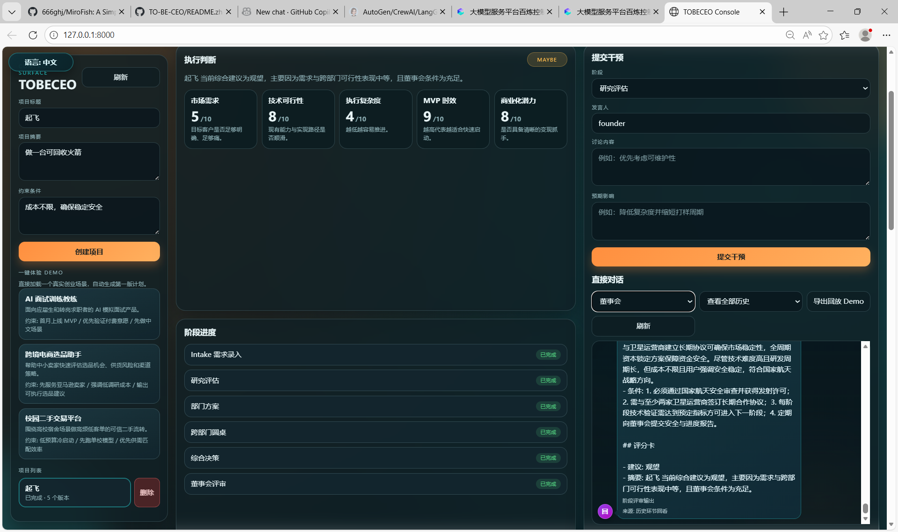

# Intelligent Brain Company

An AI boardroom for startup ideas.

Turn one raw idea into a structured company decision flow:

- research before optimism
- department debate before commitment
- board verdict before execution
- intervention-driven replanning when assumptions change

[中文文档](./README.zh-CN.md)

---

## Why it feels different

Most AI tools give you one polished answer.

Intelligent Brain Company gives you a process:

1. Research
2. Department plans
3. Cross-department roundtable
4. Synthesis
5. Board decision with scorecard

You can chat with agents at any stage and promote important chat turns into formal interventions.

---

## Product Snapshot


### What is available now

- Web Console at root path
- Flask API for project, planning, timeline, diff, and chat
- CLI for quick local planning drafts
- Persistent project/task state with SQLite
- Chinese and English conversation modes
- Stage history replay and employee-level roundtable logs

### Designed for

- founders pressure-testing early ideas
- product teams evaluating strategic bets
- accelerators and startup programs
- builders who want structured pushback, not generic encouragement

---

## Quick Start

### 1. Install

```bash
python -m pip install -e .[dev]
```

### 2. Run API + Console

```bash
ibc-api
```

Open:

- http://127.0.0.1:8000
- http://127.0.0.1:8000/health

### 3. Run CLI

```bash
ibc-plan "AI copilot for independent gyms" \
  --summary "Help gym owners automate retention and upsell workflows." \
  --constraint "Keep CAC under control" \
  --metric "Monthly retention > 90%"
```

---

## API in 60 Seconds

### Create a project

```bash
curl -X POST http://127.0.0.1:8000/api/projects \
  -H "Content-Type: application/json" \
  -d '{
    "title": "AI interviewer for junior candidates",
    "summary": "Automated pre-screening with role-specific rubrics.",
    "constraints": ["Avoid biased scoring"],
    "metrics": ["Interview completion rate > 70%"],
    "language": "en-US"
  }'
```

### Run next stage

```bash
curl -X POST http://127.0.0.1:8000/api/planning/generate \
  -H "Content-Type: application/json" \
  -d '{"project_id":"<PROJECT_ID>"}'
```

Call generate repeatedly to move through stages.

### Chat with an agent

```bash
curl -X POST http://127.0.0.1:8000/api/projects/<PROJECT_ID>/chat \
  -H "Content-Type: application/json" \
  -d '{"agent":"research", "message":"What is the biggest go-to-market risk?"}'
```

### Compare two plan versions

```bash
curl "http://127.0.0.1:8000/api/projects/<PROJECT_ID>/plans/diff?from=<V1>&to=<V2>"
```

---

## Stage Flow

1. `research`
2. `department_design`
3. `roundtable`
4. `synthesis`
5. `board`

The scorecard and recommendation are produced at the board stage.

---

## Screenshots





---

## Configuration

Optional environment variables:

- `IBC_HOST` default `127.0.0.1`
- `IBC_PORT` default `8000`
- `IBC_DATA_DIR` default `.data`
- `IBC_LLM_API_KEY`
- `IBC_LLM_BASE_URL`
- `IBC_LLM_MODEL`
- `IBC_LLM_TIMEOUT_SECONDS` default `45`

Without LLM config, the app still runs in deterministic demo mode.

---

## Deploy

This repo includes Render deployment support:

- `render.yaml`
- WSGI entrypoint at `src/intelligent_brain_company/wsgi.py`

See detailed notes in `docs/deployment.md`.

---

## Docs

- `docs/architecture.md`
- `docs/agent-contracts.md`
- `docs/evaluation-rubric.md`
- `docs/execution-plan.md`

---

## Roadmap

- Stronger board debate mechanics
- Checkpoint-aware selective recomputation
- Multi-user auth and workspace isolation
- Managed DB option for production
- Automated quality regression evaluation

---

## Contributing

Issues and pull requests are welcome.

If you want to contribute quickly, start with:

- new domain test cases
- better intervention heuristics
- richer board scoring dimensions
- UX improvements for plan diff and timeline views

---

## License

Apache-2.0
